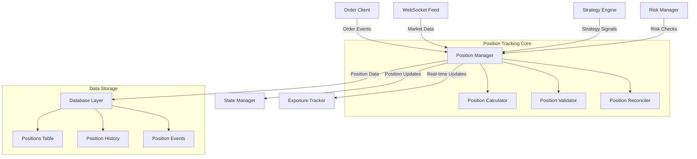

# Position Tracking System Architecture

## Overview
This document outlines the comprehensive architecture for implementing a unified position tracking system with resilient retry logic and circuit breaker patterns for the Polymarket trading bot.

## 1. Unified Position Model

### Core Position Data Structure
```python
from dataclasses import dataclass, field
from typing import Optional, Dict, Any
from datetime import datetime
from enum import Enum

class PositionStatus(Enum):
    OPEN = "open"
    CLOSED = "closed"
    PENDING = "pending"
    PARTIALLY_FILLED = "partially_filled"
    CANCELLED = "cancelled"

class PositionSide(Enum):
    LONG = "long"
    SHORT = "short"

@dataclass
class Position:
    """Unified position model capturing all necessary trading data."""
    
    # Core identifiers
    position_id: str  # Unique identifier for this position
    token_id: str  # Polymarket token identifier
    market_slug: str  # Market identifier (e.g., "will-bitcoin-close-above-100k")
    outcome_type: str  # Outcome type (e.g., "yes", "no")
    
    # Position details
    side: PositionSide
    size: float  # Current position size
    notional_value: float  # USD notional value
    average_price: float  # Average entry price
    current_price: float  # Current market price
    
    # P&L tracking
    unrealized_pnl: float  # Unrealized profit/loss
    realized_pnl: float  # Realized profit/loss
    total_fees: float  # Total fees paid
    
    # Strategy and metadata
    strategy_id: Optional[str] = None  # Associated strategy identifier
    parent_order_id: Optional[str] = None  # Original order that created this position
    
    # Status and timestamps
    status: PositionStatus = PositionStatus.OPEN
    created_at: datetime = field(default_factory=datetime.utcnow)
    updated_at: datetime = field(default_factory=datetime.utcnow)
    closed_at: Optional[datetime] = None
    
    # Additional metadata
    metadata: Dict[str, Any] = field(default_factory=dict)
    
    # Risk metrics
    max_drawdown: float = 0.0
    risk_score: float = 0.0
    
    # Position lifecycle tracking
    fills: list = field(default_factory=list)  # Individual fills that compose this position
    adjustments: list = field(default_factory=list)  # Position adjustments
    
    @property
    def is_open(self) -> bool:
        return self.status == PositionStatus.OPEN
    
    @property
    def is_closed(self) -> bool:
        return self.status == PositionStatus.CLOSED
    
    @property
    def total_pnl(self) -> float:
        return self.unrealized_pnl + self.realized_pnl
    
    def update_price(self, new_price: float) -> None:
        """Update current price and recalculate P&L."""
        self.current_price = new_price
        self.unrealized_pnl = (new_price - self.average_price) * self.size
        self.updated_at = datetime.utcnow()
```

## 2. Position Tracking System Architecture

### System Components



### Position Manager Service

```python
class PositionManager:
    """Central service for managing all position-related operations."""
    
    def __init__(
        self,
        state_manager: StateManager,
        order_client: OrderClient,
        exposure_tracker: RealTimeExposureTracker,
        config: PositionConfig
    ):
        self.state = state_manager
        self.order_client = order_client
        self.exposure_tracker = exposure_tracker
        self.config = config
        
        # Internal components
        self.calculator = PositionCalculator()
        self.validator = PositionValidator()
        self.reconciler = PositionReconciler()
        self.repository = PositionRepository()
        
        # Event handlers
        self.event_bus = EventBus()
        
    async def initialize(self) -> None:
        """Initialize position tracking system."""
        await self.repository.initialize()
        await self.reconciler.start_periodic_reconciliation()
        
    async def create_position(self, order: Order) -> Position:
        """Create a new position from an order."""
        position = self.calculator.create_from_order(order)
        validated_position = await self.validator.validate(position)
        
        await self.repository.save(validated_position)
        await self.state.update_position(validated_position.to_dict())
        
        self.event_bus.emit("position_created", validated_position)
        return validated_position
        
    async def update_position(self, position_id: str, update: PositionUpdate) -> Position:
        """Update an existing position."""
        position = await self.repository.get(position_id)
        if not position:
            raise PositionNotFoundError(f"Position {position_id} not found")
            
        updated_position = self.calculator.apply_update(position, update)
        validated_position = await self.validator.validate(updated_position)
        
        await self.repository.save(validated_position)
        await self.state.update_position(validated_position.to_dict())
        
        self.event_bus.emit("position_updated", validated_position)
        return validated_position
        
    async def close_position(self, position_id: str, close_price: float) -> Position:
        """Close a position and calculate final P&L."""
        position = await self.repository.get(position_id)
        if not position:
            raise PositionNotFoundError(f"Position {position_id} not found")
            
        position.status = PositionStatus.CLOSED
        position.closed_at = datetime.utcnow()
        position.current_price = close_price
        position.realized_pnl = (close_price - position.average_price) * position.size
        
        await self.repository.save(position)
        await self.state.update_position(position.to_dict())
        
        self.event_bus.emit("position_closed", position)
        return position
```

## 3. Database Schema Extensions

### Positions Table Schema
```sql
CREATE TABLE positions (
    position_id TEXT PRIMARY KEY,
    token_id TEXT NOT NULL,
    market_slug TEXT NOT NULL,
    outcome_type TEXT NOT NULL,
    side TEXT NOT NULL CHECK (side IN ('long', 'short')),
    size REAL NOT NULL,
    notional_value REAL NOT NULL,
    average_price REAL NOT NULL,
    current_price REAL NOT NULL,
    unrealized_pnl REAL NOT NULL DEFAULT 0.0,
    realized_pnl REAL NOT NULL DEFAULT 0.0,
    total_fees REAL NOT NULL DEFAULT 0.0,
    status TEXT NOT NULL CHECK (status IN ('open', 'closed', 'pending', 'partially_filled', 'cancelled')),
    strategy_id TEXT,
    parent_order_id TEXT,
    max_drawdown REAL NOT NULL DEFAULT 0.0,
    risk_score REAL NOT NULL DEFAULT 0.0,
    metadata JSON,
    created_at TIMESTAMP DEFAULT CURRENT_TIMESTAMP,
    updated_at TIMESTAMP DEFAULT CURRENT_TIMESTAMP,
    closed_at TIMESTAMP,
    
    FOREIGN KEY (parent_order_id) REFERENCES orders(id),
    FOREIGN KEY (strategy_id) REFERENCES strategies(id)
);

CREATE INDEX idx_positions_token ON positions(token_id);
CREATE INDEX idx_positions_market ON positions(market_slug);
CREATE INDEX idx_positions_status ON positions(status);
CREATE INDEX idx_positions_strategy ON positions(strategy_id);
CREATE INDEX idx_positions_created ON positions(created_at);
```

### Position History Table
```sql
CREATE TABLE position_history (
    id INTEGER PRIMARY KEY AUTOINCREMENT,
    position_id TEXT NOT NULL,
    event_type TEXT NOT NULL, -- 'created', 'updated', 'closed', 'adjusted'
    size_before REAL,
    size_after REAL,
    price_before REAL,
    price_after REAL,
    pnl_before REAL,
    pnl_after REAL,
    metadata JSON,
    created_at TIMESTAMP DEFAULT CURRENT_TIMESTAMP,
    
    FOREIGN KEY (position_id) REFERENCES positions(position_id)
);

CREATE INDEX idx_history_position ON position_history(position_id);
CREATE INDEX idx_history_event ON position_history(event_type);
CREATE INDEX idx_history_created ON position_history(created_at);
```

### Position Events Table
```sql
CREATE TABLE position_events (
    id INTEGER PRIMARY KEY AUTOINCREMENT,
    position_id TEXT NOT NULL,
    event_type TEXT NOT NULL, -- 'fill', 'adjustment', 'close', 'liquidation'
    order_id TEXT,
    size_delta REAL,
    price REAL,
    fees REAL,
    metadata JSON,
    created_at TIMESTAMP DEFAULT CURRENT_TIMESTAMP,
    
    FOREIGN KEY (position_id) REFERENCES positions(position_id),
    FOREIGN KEY (order_id) REFERENCES orders(id)
);

CREATE INDEX idx_events_position ON position_events(position_id);
CREATE INDEX idx_events_order ON position_events(order_id);
```

## 4. Integration Points

### Integration with Order Client
```python
class EnhancedOrderClient:
    """Enhanced order client with position tracking integration."""
    
    def __init__(self, position_manager: PositionManager):
        self.position_manager = position_manager
        
    async def place_order(self, order: Order) -> dict:
        """Place order and create corresponding position."""
        # Existing order placement logic
        
        # Create position from successful order
        if order_response.get("status") == "FILLED":
            position = await self.position_manager.create_position(order)
            logger.info(f"Created position {position.position_id} from order {order.id}")
            
        return order_response
```

### Integration with Exposure Tracker
```python
class PositionExposureBridge:
    """Bridge between position tracking and exposure tracker."""
    
    def __init__(self, position_manager: PositionManager, exposure_tracker: RealTimeExposureTracker):
        self.position_manager = position_manager
        self.exposure_tracker = exposure_tracker
        
    async def sync_positions(self) -> None:
        """Sync positions between systems."""
        positions = await self.position_manager.get_all_positions()
        
        for position in positions:
            if position.is_open:
                update = PositionUpdate(
                    token_id=position.token_id,
                    size=position.size,
                    price=position.current_price,
                    notional_value=position.notional_value,
                    market_slug=position.market_slug,
                    outcome_type=position.outcome_type
                )
                await self.exposure_tracker.add_position_update(update)
```

### Integration with State Manager
```python
class PositionStateAdapter:
    """Adapter for integrating position tracking with state manager."""
    
    def __init__(self, state_manager: StateManager):
        self.state = state_manager
        
    async def save_position(self