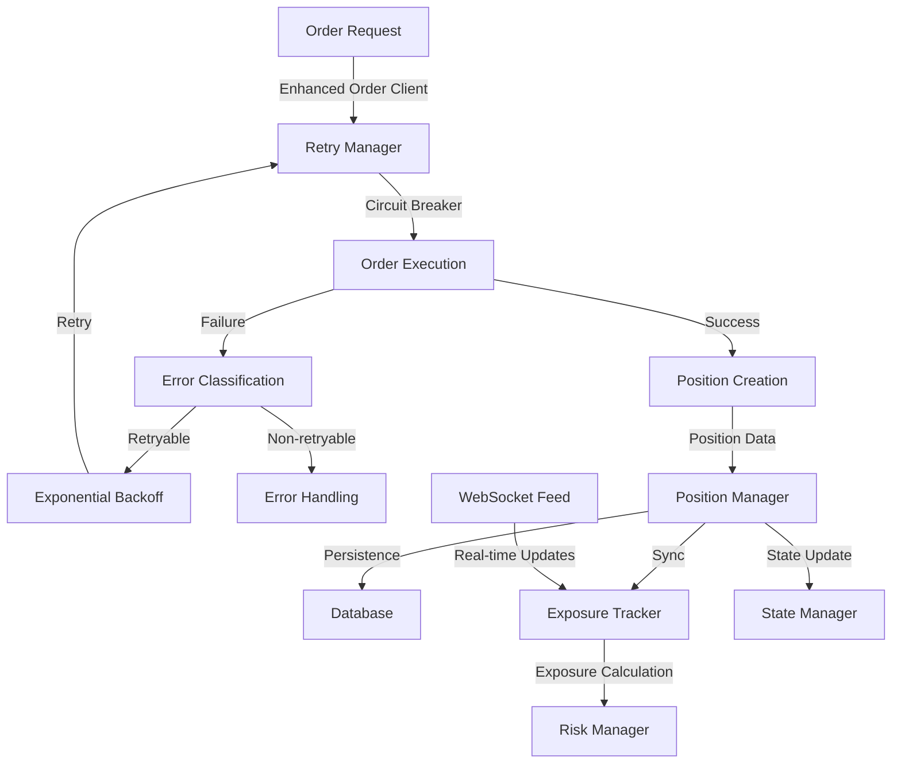

# Comprehensive Architecture Summary

## Executive Summary
This document provides a complete architectural design for implementing a unified position tracking system with resilient retry logic and circuit breaker patterns for the Polymarket trading bot. The architecture is designed to be robust, scalable, and maintain backward compatibility with the existing codebase.

## Architecture Components Overview

### 1. Position Tracking System
- **Unified Position Model**: Comprehensive data structure capturing all position attributes
- **Position Manager**: Central service for position lifecycle management
- **Database Schema**: Extended tables for positions, history, and events
- **Integration Layer**: Seamless integration with existing systems

### 2. Resilient Retry Logic
- **Error Classification**: Systematic categorization of errors for retry decisions
- **Exponential Backoff**: Configurable backoff strategy with jitter
- **Circuit Breaker**: Protection against cascading failures
- **Idempotency Keys**: Prevention of duplicate operations

### 3. Integration Architecture
- **Enhanced Order Client**: Upgraded order client with retry and position tracking
- **Position-Exposure Bridge**: Synchronization between position and exposure systems
- **State Management**: Integration with existing state persistence
- **Configuration Management**: Centralized configuration system

## Key Architectural Decisions

### 1. Backward Compatibility
- **Gradual Migration**: New systems can coexist with existing ones
- **Fallback Mechanisms**: Graceful degradation when new features unavailable
- **Data Migration**: Scripts for migrating existing position data

### 2. Performance Considerations
- **Caching Strategy**: In-memory caching for frequently accessed data
- **Batch Processing**: Efficient bulk operations
- **Async Operations**: Non-blocking I/O throughout the system

### 3. Reliability Features
- **Circuit Breaker**: Protection against external service failures
- **Retry Logic**: Automatic recovery from transient failures
- **Idempotency**: Prevention of duplicate operations
- **Monitoring**: Comprehensive logging and metrics

## Implementation Phases

### Phase 1: Foundation (Week 1-2)
- [ ] Implement unified position model
- [ ] Create position database schema
- [ ] Set up basic position repository
- [ ] Implement position calculator

### Phase 2: Core Services (Week 3-4)
- [ ] Implement PositionManager service
- [ ] Create error classification system
- [ ] Implement retry manager with exponential backoff
- [ ] Set up circuit breaker pattern

### Phase 3: Integration (Week 5-6)
- [ ] Integrate with existing order client
- [ ] Create position-exposure bridge
- [ ] Implement idempotency key system
- [ ] Add configuration management

### Phase 4: Testing & Optimization (Week 7-8)
- [ ] Comprehensive unit tests
- [ ] Integration tests
- [ ] Performance testing
- [ ] Documentation and deployment

## Data Flow Architecture



## Configuration Reference

### Position Configuration
```yaml
position_tracking:
  database_path: "positions.db"
  enable_persistence: true
  max_position_size: 10000.0
  min_position_size: 1.0
  sync_interval: 30
  enable_real_time_updates: true
```

### Retry Configuration
```yaml
retry_logic:
  max_retries: 3
  initial_delay: 1.0
  max_delay: 60.0
  multiplier: 2.0
  jitter: true
  circuit_breaker:
    failure_threshold: 5
    recovery_timeout: 60
    half_open_max_calls: 3
  idempotency:
    ttl_hours: 24
    enable: true
```

## Testing Strategy

### Test Coverage Targets
- **Unit Tests**: 90%+ coverage for new components
- **Integration Tests**: All major integration points
- **End-to-End Tests**: Complete trading scenarios
- **Performance Tests**: Load testing for high-frequency scenarios

### Test Categories
1. **Model Tests**: Position model validation
2. **Service Tests**: Position manager functionality
3. **Integration Tests**: System integration
4. **Retry Tests**: Retry logic and circuit breaker
5. **Database Tests**: Persistence layer
6. **Performance Tests**: Load and stress testing

## Security Considerations

### Data Protection
- **Encryption**: Sensitive data encryption at rest
- **Access Control**: Role-based access to position data
- **Audit Trail**: Complete audit logging for position changes

### Operational Security
- **Rate Limiting**: Protection against abuse
- **Input Validation**: Comprehensive input sanitization
- **Error Handling**: Secure error messages without sensitive data

## Monitoring & Observability

### Metrics Collection
- **Position Metrics**: Count, size, P&L distribution
- **Retry Metrics**: Retry counts, success rates, circuit breaker states
- **Performance Metrics**: Response times, throughput, error rates
- **Business Metrics**: Trading volume, profit/loss, risk exposure

### Alerting Strategy
- **Circuit Breaker Alerts**: When circuits open
- **Error Rate Alerts**: High error rates
- **Performance Alerts**: Slow response times
- **Business Alerts**: Unusual trading patterns

## Deployment Strategy

### Rollout Plan
1. **Staging Environment**: Full testing with real data
2. **Canary Deployment**: Gradual rollout to subset of users
3. **Blue-Green Deployment**: Zero-downtime deployment
4. **Rollback Plan**: Quick rollback capability

### Migration Strategy
1. **Data Migration**: Scripts for existing position data
2. **Feature Flags**: Gradual feature enablement
3. **Monitoring**: Real-time monitoring during migration
4. **Rollback**: Immediate rollback capability

## Success Criteria

### Functional Requirements
- [ ] All position data accurately tracked
- [ ] Retry logic prevents duplicate orders
- [ ] Circuit breaker protects against failures
- [ ] Backward compatibility maintained

### Performance Requirements
- [ ] Position queries < 10ms
- [ ] Order placement < 100ms
- [ ] System handles 1000+ positions
- [ ] 99.9% uptime target

### Quality Requirements
- [ ] 90%+ test coverage
- [ ] Zero critical security vulnerabilities
- [ ] Comprehensive documentation
- [ ] Performance benchmarks documented

## Next Steps

1. **Review Architecture**: Team review and feedback
2. **Refine Design**: Address any identified issues
3. **Create Implementation Plan**: Detailed task breakdown
4. **Begin Implementation**: Start with Phase 1
5. **Continuous Monitoring**: Track progress and adjust

## Risk Assessment

### High-Risk Areas
- **Database Migration**: Existing data migration complexity
- **Performance Impact**: New features may impact performance
- **Integration Complexity**: Multiple system integration points

### Mitigation Strategies
- **Incremental Rollout**: Gradual feature enablement
- **Comprehensive Testing**: Extensive testing at each phase
- **Monitoring**: Real-time monitoring and alerting
- **Rollback Plan**: Immediate rollback capability

## Conclusion

This architecture provides a robust foundation for implementing comprehensive position tracking and resilient retry logic. The design emphasizes reliability, performance, and maintainability while ensuring backward compatibility with the existing system.

The phased implementation approach allows for careful validation at each step, reducing risk and ensuring smooth deployment. The comprehensive testing strategy ensures quality and reliability throughout the implementation process.