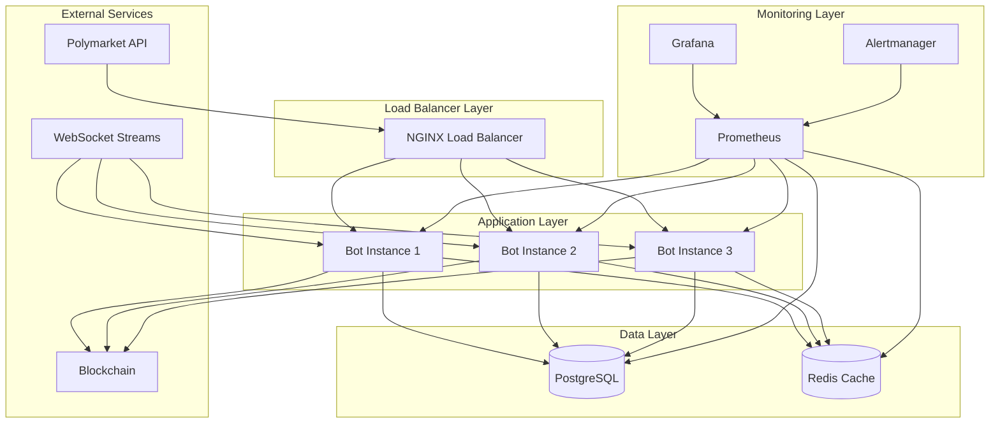
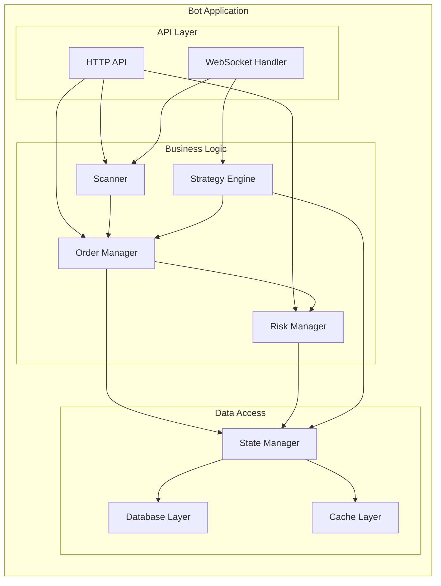
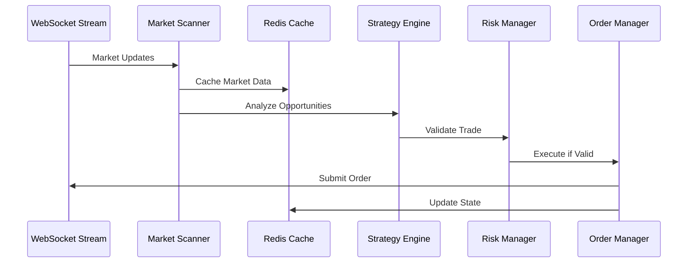
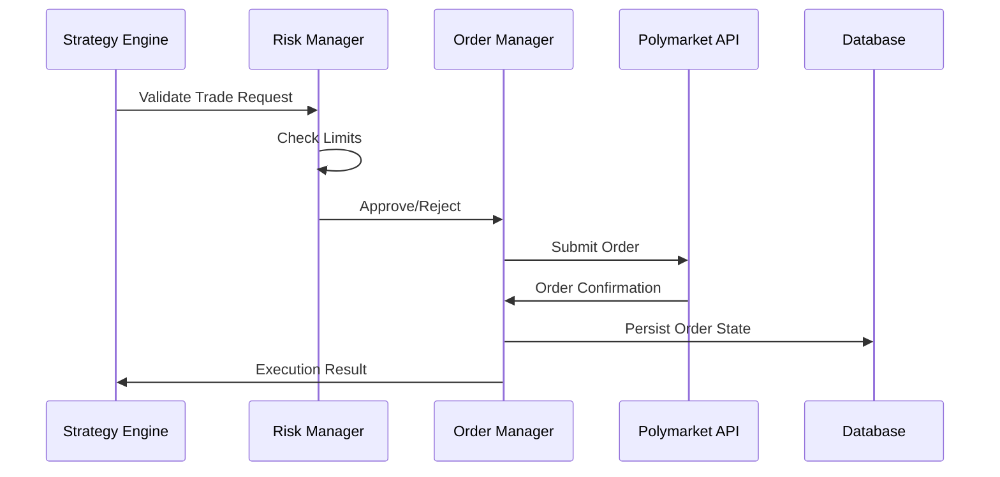
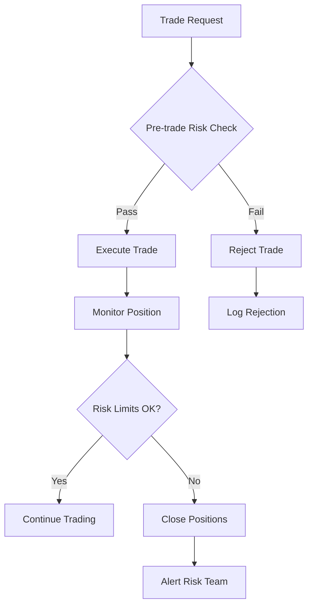
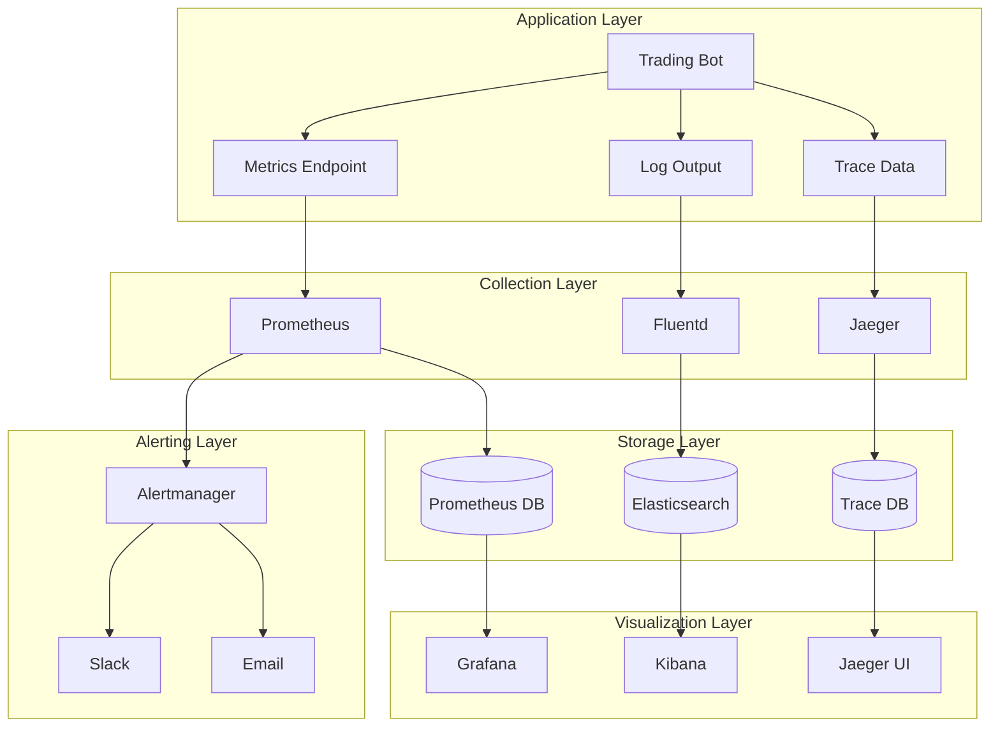

# Architecture Overview

This document provides a comprehensive overview of the InkedUp Polymarket Bot architecture, including system design, component interactions, and deployment topology.

## Table of Contents

1. [System Overview](#system-overview)
2. [Component Architecture](#component-architecture)
3. [Data Flow](#data-flow)
4. [Deployment Architecture](#deployment-architecture)
5. [Security Architecture](#security-architecture)
6. [Monitoring Architecture](#monitoring-architecture)
7. [Scalability Considerations](#scalability-considerations)

## System Overview

The InkedUp Polymarket Bot is a microservices-based trading system designed for automated arbitrage and market making on the Polymarket platform. The system follows cloud-native principles with containerized services, event-driven architecture, and comprehensive observability.

### Core Principles

- **Reliability**: High availability through redundancy and fault tolerance
- **Scalability**: Horizontal scaling capabilities for increased throughput  
- **Security**: Defense-in-depth security model with multiple layers
- **Observability**: Comprehensive monitoring, logging, and alerting
- **Maintainability**: Clean architecture with clear separation of concerns

### Architecture Diagram



## Component Architecture

### Core Components

#### 1. Trading Bot (`inkedup_bot/`)

**Purpose**: Main application logic for trading operations

**Key Modules**:
- `cli.py`: Command-line interface and application entry point
- `scanner.py`: Market scanning and opportunity detection
- `order_client.py`: Order execution and management
- `state.py`: Application state management
- `config.py`: Configuration management

**Responsibilities**:
- Market data analysis
- Arbitrage opportunity detection
- Order placement and execution
- Risk management
- Position tracking

#### 2. Strategy Engine (`inkedup_bot/strategies/`)

**Purpose**: Implement trading strategies

**Components**:
- `complement.py`: Complement arbitrage strategy
- `spread_arbitrage.py`: Spread arbitrage implementation

**Architecture Pattern**: Strategy Pattern
- Pluggable strategy implementations
- Common interface for all strategies
- Dynamic strategy selection based on market conditions

#### 3. Risk Management (`inkedup_bot/risk/`)

**Purpose**: Risk control and position management

**Components**:
- `manager.py`: Central risk management
- `validators.py`: Risk validation rules
- `exposure_tracker.py`: Exposure monitoring
- `atomic_operations.py`: Thread-safe operations

**Features**:
- Real-time risk monitoring
- Position size limits
- Exposure caps
- Correlation analysis

#### 4. Data Layer

**Database (PostgreSQL)**:
- **Orders**: Order history and state
- **Positions**: Current and historical positions  
- **Markets**: Market metadata and state
- **Risk**: Risk metrics and limits

**Cache (Redis)**:
- Market data cache
- Order book snapshots
- Rate limiting counters
- Session data

### Service Architecture



## Data Flow

### 1. Market Data Flow



### 2. Order Execution Flow



### 3. Risk Management Flow



## Deployment Architecture

### Environment Topology

#### Development Environment
```
┌─────────────────┐
│ Developer       │
│ Machine         │
│                 │
│ ┌─────────────┐ │
│ │ Docker      │ │
│ │ Compose     │ │
│ │             │ │
│ │ • App       │ │
│ │ • Database  │ │
│ │ • Redis     │ │
│ │ • Monitoring│ │
│ └─────────────┘ │
└─────────────────┘
```

#### Staging Environment
```
┌─────────────────────────────────────┐
│ Staging Server                      │
│                                     │
│ ┌─────────────┐ ┌─────────────────┐ │
│ │ Load        │ │ Application     │ │
│ │ Balancer    │ │ Container       │ │
│ │ (NGINX)     │ │                 │ │
│ └─────────────┘ └─────────────────┘ │
│                                     │
│ ┌─────────────┐ ┌─────────────────┐ │
│ │ PostgreSQL  │ │ Redis Cache     │ │
│ │ Database    │ │                 │ │
│ └─────────────┘ └─────────────────┘ │
│                                     │
│ ┌─────────────────────────────────┐ │
│ │ Monitoring Stack               │ │
│ │ • Prometheus                   │ │
│ │ • Grafana                      │ │
│ │ • Alertmanager                 │ │
│ └─────────────────────────────────┘ │
└─────────────────────────────────────┘
```

#### Production Environment
```
┌─────────────────────────────────────────────────────────────┐
│ Production Cluster                                          │
│                                                             │
│ ┌─────────────┐    ┌──────────────────────────────────────┐ │
│ │ External    │    │ Application Layer (Auto-Scaling)     │ │
│ │ Load        │    │                                      │ │
│ │ Balancer    │────│ ┌────────┐ ┌────────┐ ┌────────┐    │ │
│ │ (CloudFlare)│    │ │Bot #1  │ │Bot #2  │ │Bot #3  │    │ │
│ └─────────────┘    │ └────────┘ └────────┘ └────────┘    │ │
│                    └──────────────────────────────────────┘ │
│                                                             │
│ ┌──────────────────────────────────────┐                   │
│ │ Data Layer                           │                   │
│ │                                      │                   │
│ │ ┌────────────┐  ┌─────────────────┐ │                   │
│ │ │PostgreSQL  │  │ Redis Cluster   │ │                   │
│ │ │Primary +   │  │ (HA)            │ │                   │
│ │ │Read Replica│  │                 │ │                   │
│ │ └────────────┘  └─────────────────┘ │                   │
│ └──────────────────────────────────────┘                   │
│                                                             │
│ ┌──────────────────────────────────────┐                   │
│ │ Monitoring & Observability           │                   │
│ │                                      │                   │
│ │ ┌──────┐ ┌──────┐ ┌──────┐ ┌──────┐ │                   │
│ │ │Prom  │ │Graf  │ │Alert │ │Logs  │ │                   │
│ │ └──────┘ └──────┘ └──────┘ └──────┘ │                   │
│ └──────────────────────────────────────┘                   │
└─────────────────────────────────────────────────────────────┘
```

### Container Architecture

```yaml
# High-level container structure
services:
  # Application tier
  app:
    replicas: 3
    resources:
      memory: 2G
      cpu: 1.0
    health_checks: enabled
    
  # Load balancer
  nginx:
    replicas: 1
    ports: [80, 443]
    ssl: enabled
    
  # Data tier
  database:
    replicas: 1
    persistence: true
    backup: automated
    
  redis:
    replicas: 1
    persistence: optional
    
  # Monitoring
  prometheus:
    replicas: 1
    retention: 90d
    
  grafana:
    replicas: 1
    dashboards: preconfigured
```

## Security Architecture

### Defense in Depth

```
┌─────────────────────────────────────────────────────────────┐
│ Network Security Layer                                      │
│ • Firewall rules • VPN access • Network segmentation      │
└─────────────────────────────────────────────────────────────┘
                              │
┌─────────────────────────────────────────────────────────────┐
│ Application Security Layer                                  │
│ • Authentication • Authorization • Input validation        │
└─────────────────────────────────────────────────────────────┘
                              │
┌─────────────────────────────────────────────────────────────┐
│ Container Security Layer                                    │
│ • Non-root user • Read-only filesystem • Resource limits   │
└─────────────────────────────────────────────────────────────┘
                              │
┌─────────────────────────────────────────────────────────────┐
│ Data Security Layer                                         │
│ • Encryption at rest • TLS in transit • Key management     │
└─────────────────────────────────────────────────────────────┘
```

### Security Components

1. **Network Security**
   - VPC/VNET isolation
   - Security groups/firewalls
   - Private subnets for databases

2. **Application Security**
   - JWT authentication
   - API rate limiting
   - Input validation
   - CORS policies

3. **Container Security**
   - Non-privileged containers
   - Read-only root filesystems
   - Security scanning (Trivy)
   - Image signing

4. **Data Security**
   - Database encryption at rest
   - TLS 1.3 for all communications
   - Secrets management (Vault/K8s secrets)
   - Key rotation policies

## Monitoring Architecture

### Observability Stack



### Metrics Hierarchy

```
Business Metrics
├── Trading Volume
├── P&L Tracking
├── Strategy Performance
└── Market Coverage

Application Metrics
├── API Response Times
├── Error Rates
├── Database Performance
└── Queue Depths

Infrastructure Metrics
├── CPU Usage
├── Memory Usage
├── Network I/O
└── Disk Usage

External Metrics
├── Polymarket API Status
├── Blockchain Sync Status
└── Third-party Services
```

## Scalability Considerations

### Horizontal Scaling

#### Application Scaling
```yaml
# Auto-scaling configuration
deploy:
  replicas: 3
  update_config:
    parallelism: 1
    delay: 10s
  restart_policy:
    condition: any
  resources:
    limits:
      memory: 2G
      cpus: '1.0'
    reservations:
      memory: 1G
      cpus: '0.5'
```

#### Database Scaling
- **Read Replicas**: Distribute read operations
- **Connection Pooling**: Efficient connection management
- **Query Optimization**: Indexed queries and caching

#### Cache Scaling
- **Redis Cluster**: Distributed caching
- **Cache Partitioning**: Logical separation of cache data
- **TTL Management**: Automatic cache expiration

### Vertical Scaling

#### Resource Optimization
```yaml
# Resource allocation per service
services:
  app:
    resources:
      limits: {memory: 4G, cpus: '2.0'}
      reservations: {memory: 2G, cpus: '1.0'}
  
  database:
    resources:
      limits: {memory: 8G, cpus: '4.0'}
      reservations: {memory: 4G, cpus: '2.0'}
  
  redis:
    resources:
      limits: {memory: 2G, cpus: '1.0'}
      reservations: {memory: 1G, cpus: '0.5'}
```

### Performance Optimization

#### Application Level
- **Async Processing**: Non-blocking I/O operations
- **Connection Pooling**: Database and HTTP connection reuse
- **Caching Strategy**: Multi-level caching (Redis, in-memory)
- **Batch Processing**: Bulk operations for efficiency

#### Database Level
- **Indexing Strategy**: Optimized database indexes
- **Query Optimization**: Efficient SQL queries
- **Partitioning**: Table partitioning for large datasets
- **Archival**: Historical data archival

#### Network Level
- **CDN**: Content delivery network for static assets
- **Load Balancing**: Distribute traffic across instances
- **Connection Keep-Alive**: Persistent HTTP connections
- **Compression**: GZIP compression for responses

---

## Summary

The InkedUp Polymarket Bot architecture provides:

1. **Scalability**: Horizontal and vertical scaling capabilities
2. **Reliability**: High availability through redundancy
3. **Security**: Multi-layer security model
4. **Observability**: Comprehensive monitoring and alerting
5. **Maintainability**: Clean separation of concerns

This architecture supports production-grade deployment with enterprise-level reliability, security, and performance characteristics.

---

**Last Updated**: January 20, 2024  
**Version**: 1.0.0